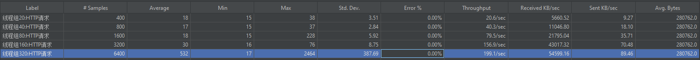
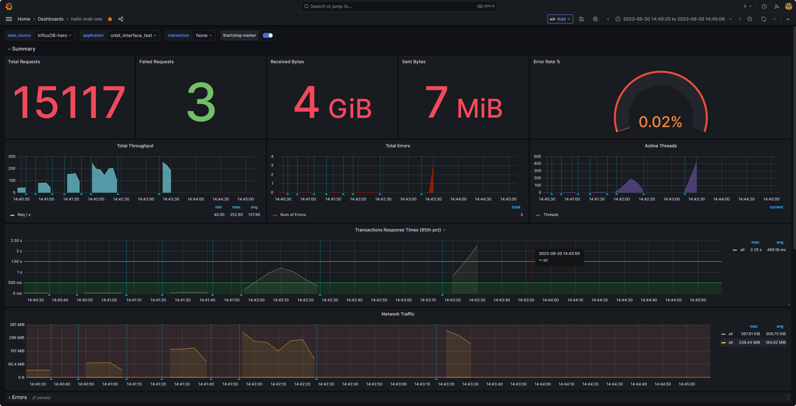
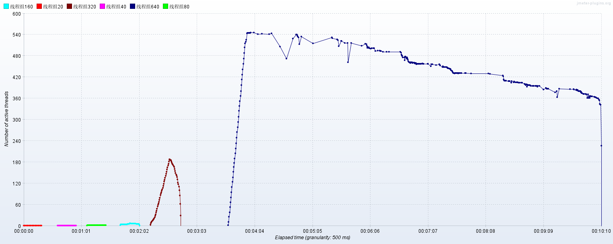
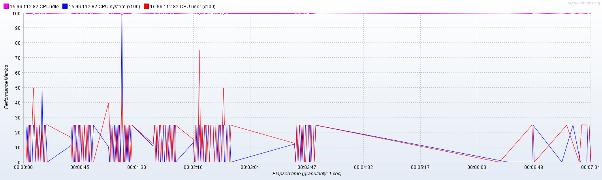
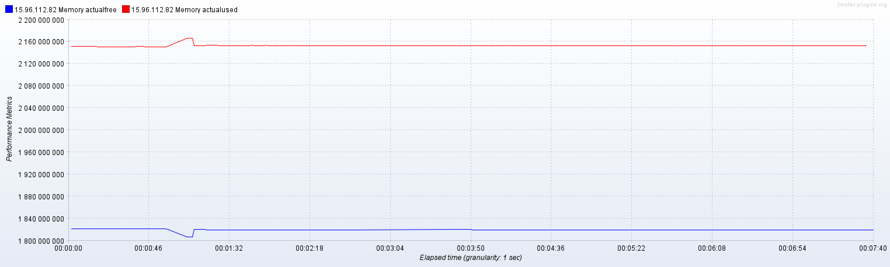
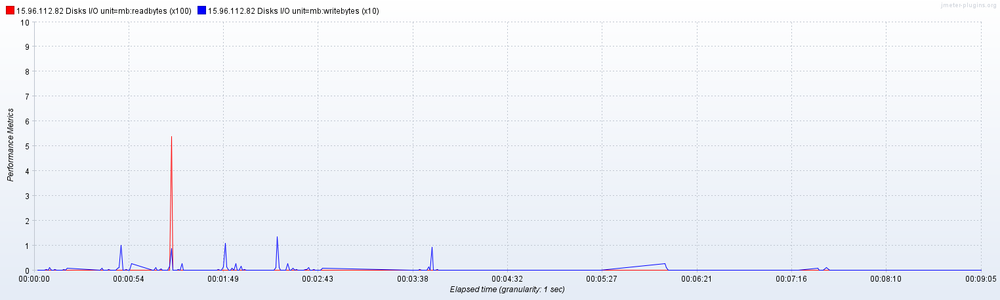
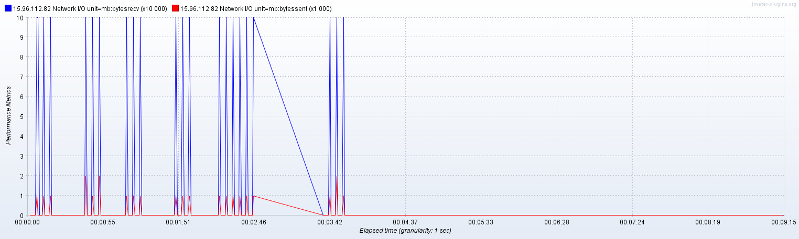

# 项目性能测试报告

## 01-测试目的

主要是让开发者对项目A的性能负载和容量有个准确的认知。同时，协助技术管理者更好的管理业务系统性能质量，科学评估业务系统的负荷，拒绝盲目上线。

## 02-测试工具

apache-jmeter-5.4

## 03-测试环境

### 3.1 环境

| 指标              | 参数          |
| ----------------- |-------------|
| 机器              | 6C12线程      |
| 测试规模          | 单机          |
| 项目A | 2.1.11_BETA |
| 数据库            | redis集群     |

### 3.1 设置启动参数

跳过

## 04-测试场景
由于org信息涉及非常多的表，所以不得不存放在redis，只有在第一次获取信息的时候才会去加载数据库，所以我们这里测试的是Redis。

测试场景一般情况下是都是最重要接口：验证项目A获取org信息接口在不同并发规模的表现。

**模拟场景**: 
- 用户访问接口并发逐渐增加的过程。接口1次调用的响应时间为31ms，线程梯度：20、40，80, 160，320个，循环20次;

- 时间设置：Ramp-up period(inseconds)的值设为对应线程数/10

## 05-核心接口的测试结果

### 一、Org信息获取接口

验证项目A服务获取org信息接口能力性能。

汇总报告：

Active Threads Over Time：随着时间的推移，活动线程数的变化情况,本来要模拟640个，但是在540的时候卡死了，无法再创建线程。

GC TPS Over Time：随着时间的推移，GC TPS的变化情况

CPU Over Time：随着时间的推移，CPU的变化情况

Memory Over Time：随着时间的推移，Memory的变化情况

磁盘读写情况：随着时间的推移，磁盘读写情况的变化情况

网络I/O Over Time：随着时间的推移，网络I/O的变化情况 单位是M

## 06-测试结论及优化
由于是redis，所以内存不存在波多；由于是局域网所以不考虑网络IO问题。

结论
- 1：CPU的性能达到了瓶颈
- 2：请求达到tomcat的最大线程数200

优化：
- 结论1：单机性能达到了瓶颈，需要考虑分布式部署
- 结论2：修改tomcat配置max-threads/accept-count;或者替换tomcat。

